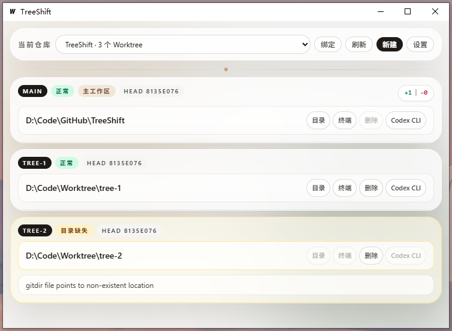

# TreeShift



[查看主界面原图](https://github.com/XiaoSeee/TreeShift/blob/main/assets/main.png)

TreeShift 是一个面向 Windows 的 Git worktree 桌面管理器，用来把一个仓库下的多个工作区集中展示出来，并快速完成创建、删除、打开目录、打开终端以及拉起外部 CLI 工具等操作。

它适合经常同时处理多个分支的人，比如并行开发多个功能、切换修复任务，或者在不同 worktree 中分别启动终端和 AI CLI 工具。

## 功能简介

- 绑定一个或多个 Git 仓库，并自动读取当前仓库的 worktree 列表
- 支持以游离 HEAD 创建 worktree，也支持基于现有分支创建，或从某个基线分支新建分支并创建
- 统一展示 worktree 状态，包括正常、目录缺失、待清理目录等情况
- 支持在卡片上直接切换 linked worktree 的“正常 / 锁定”模式，锁定后不会因为目录暂时不可访问而被自动清理
- 对游离 HEAD worktree 使用专门的 `DETACHED` 标签展示，并可直接附着到新分支或空闲的现有分支
- 在指定 worktree 中快速打开资源管理器和 Windows Terminal
- 配置外部 CLI 工具，并在目标 worktree 中直接启动
- 支持目录拖拽绑定仓库

## 运行环境

- Windows 10 / 11
- Git
- Windows Terminal
- 启动默认只检查 Git 和 Windows Terminal，不会检查可选外部 CLI
- 如果要使用外部工具启动功能，还需要本机已安装对应 CLI，并能从设置中正确配置命令

## 使用说明

### 1. 绑定仓库

启动应用后，先绑定一个主 Git 仓库。你可以：

- 点击“绑定”按钮后选择目录
- 直接把仓库目录拖进主界面
- 粘贴一个本地仓库路径进行绑定

绑定完成后，TreeShift 会自动读取该仓库已有的 worktree，并在主界面中以卡片形式展示。

### 2. 创建 Worktree

点击“新建”后，可以选择三种模式：

- 以游离 HEAD 创建
- 基于现有分支创建 worktree
- 创建新分支并创建

“以游离 HEAD 创建”适合先从某个现有分支拉出一个不立即绑定分支名的 worktree，后续再决定是否落到正式分支上。

目标目录会根据建议根目录和分支名自动生成，你也可以手动修改。

### 3. 管理已有 Worktree

每张 worktree 卡片都可以执行常用操作：

- 打开目录
- 打开终端
- 删除 worktree
- 启动外部工具

对于仍然保留 Git 记录的 linked worktree，卡片上的模式标签可以在“正常”和“锁定”之间切换：

- “正常”模式下，保持当前行为；如果目录已经被外部删除，会显示为“目录缺失”，并允许后续清理 Git 记录
- “锁定”模式下，会调用 Git 官方 `worktree lock` 语义，避免目录位于移动硬盘、网络盘等暂时不可访问场景时被误清理
- 如果锁定的 worktree 目录当前不可访问，界面会同时显示“锁定 + 目录缺失”
- 已锁定的 worktree 不能直接删除，必须先解锁再删除

如果某个 worktree 处于游离 HEAD 状态，卡片上的分支标签会显示为 `DETACHED`。点击这个标签后，可以：

- 基于当前游离 HEAD 创建一个新分支并切换过去
- 直接切换到一个当前没有被其他 worktree 占用的现有本地分支

如果 Git 记录已经删除但物理目录还没清理完，TreeShift 会把它保留为“待清理”状态，方便后续继续处理，而不是直接从界面里消失。

如果一个已锁定的 worktree 被用户手动删掉了目录，TreeShift 不会自动移除它的 Git 记录；只会把卡片显示为“锁定 + 目录缺失”，等待你明确解锁并清理。

### 4. 配置外部工具

在“设置”中可以添加外部 CLI 工具，例如 Codex CLI。每一行参数都会作为一个独立参数传给命令，支持以下占位符：

首次启动时会预置一个 Codex CLI 模板，方便你直接修改或复用；如果你不使用它，可以在设置中自行调整或删除。

- `{path}`：当前 worktree 的目录
- `{branch}`：当前 worktree 的分支名

例如可以配置一组参数，让工具启动后直接在目标 worktree 下工作。

### 5. 仓库与默认路径设置

在“设置”中还可以：

- 修改仓库显示名称
- 为单个仓库设置默认 worktree 根目录
- 设置全局默认 worktree 根目录
- 解除仓库绑定

解除绑定只会移除本地配置，不会删除任何 Git 数据或目录。

## 从源码运行

### 开发模式

```powershell
cd frontend
npm.cmd install
cd ..
wails dev
```

### 构建 Windows 可执行文件

```powershell
.\build_windows.cmd
```

构建完成后，可执行文件会输出到仓库根目录的 `TreeShift.exe`。

## 配置文件说明

应用配置保存在 `config.json` 中：

- 开发模式下，默认位于项目根目录
- 打包后的可执行文件运行时，默认位于 `TreeShift.exe` 同级目录

配置中会保存仓库绑定信息、默认 worktree 路径、外部工具配置和待清理目录状态。

## 适用场景

- 同时开发多个功能分支
- 一个仓库下并行处理多个任务
- 快速切换不同 worktree 的终端环境
- 将 AI CLI 工具固定拉起到指定 worktree 中工作
